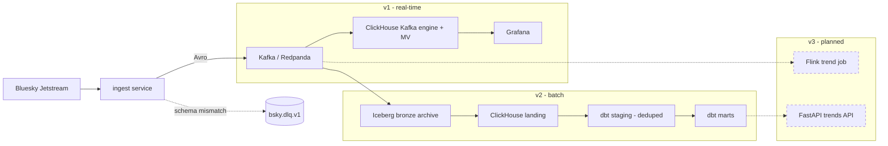

# bluesky-trends

Real-time social analytics on the [Bluesky](https://bsky.app) firehose. The pipeline consumes
the Bluesky Jetstream websocket, validates each record against versioned schemas, and turns the
stream into both real-time dashboards and batch analytics tables — trending posts, likes, and
follows. This repository holds the pipeline code only (ingest service, Dagster assets, dbt
models, and the future Flink job and API); Kubernetes manifests live in a separate `homelab-ops`
repo.

## Architecture

Events flow from the firehose into Kafka once, then fan out into two paths. The **v1** path is
real-time: ClickHouse consumes Kafka directly (Kafka engine + materialized view) into hot marts
that Grafana reads. The **v2** path is batch: a Dagster asset archives Kafka into an append-only
Iceberg bronze layer, lands it into ClickHouse, and dbt builds deduped staging and aggregate
marts, with Dagster asset checks gating freshness, volume, and null-rate. The **v3** path
(planned) adds a Flink trend-detection job and a FastAPI trends API.

Build order is strict: **v1 and v2 are complete** for all three event types (posts, likes,
follows); **v3 is not started**.



<!--  -->

## Components

| Directory   | Purpose                                                                 | Status            |
| ----------- | ----------------------------------------------------------------------- | ----------------- |
| `ingest/`   | Jetstream websocket consumer; validates, produces Avro to Kafka, persists a resume cursor to Postgres. | Implemented (v1)  |
| `schemas/`  | Pydantic models + versioned Avro schemas — the single source of truth for event shapes. | Implemented       |
| `clickhouse/` | ClickHouse init SQL: v1 Kafka-engine + MV marts and v2 landing tables.  | Implemented       |
| `grafana/`  | Provisioned datasource + dashboards for the v1 real-time marts.          | Implemented (v1)  |
| `dagster/`  | Dagster assets (`bsky_dagster`): Kafka to Iceberg bronze, Iceberg to ClickHouse landing, dbt wiring, asset checks. | Implemented (v2)  |
| `dbt/`      | dbt-clickhouse models: staging (deduped) and aggregate marts, with schema and singular tests. | Implemented (v2)  |
| `tests/`    | pytest unit tests for the pure transforms and ingest logic.             | Implemented       |
| `flink/`    | PyFlink trend-detection job (event-time windows, keyed baseline state).  | Planned (v3)      |
| `api/`      | FastAPI trends API reading ClickHouse.                                   | Planned (v3)      |

## Event types and marts

Three event types are ingested, each with its own end-to-end vertical through the v2 batch
layer:

| Event   | Kafka topic       | Mart                            | Grain                |
| ------- | ----------------- | ------------------------------- | -------------------- |
| Posts   | `bsky.posts.v1`   | `mart_posts_by_lang_daily`      | `(day, lang)`        |
| Likes   | `bsky.likes.v1`   | `mart_likes_by_subject_daily`   | `(day, subject_uri)` |
| Follows | `bsky.follows.v1` | `mart_follows_by_subject_daily` | `(day, subject_did)` |

All three share the `_Event` base (`schemas/models.py`): `did`, `rkey`, `cid`, `created_at`. A
record is uniquely identified by `(did, rkey)`; staging models dedupe on that pair with a
`ReplacingMergeTree` so at-least-once replay from the bronze archiver collapses to one row.

## Local dev quickstart

Requirements: Docker (Compose), Python 3.12, and [uv](https://docs.astral.sh/uv/). The v2 batch
dependencies (Dagster, dbt, PyIceberg, ...) live in the `v2` dependency group in `pyproject.toml`
and stay out of the ingest image.

The local stack runs via `docker-compose.dev.yml`, which uses profiles: default infra, `ingest`,
`grafana`, and `v2` (MinIO + Iceberg REST catalog). The `Makefile` wraps the common commands:

**v1 (real-time):**

```sh
make up           # Redpanda + topics + Postgres + ClickHouse
make run-ingest   # ingest in the foreground (Ctrl-C = graceful stop)
make grafana      # Grafana at http://localhost:3000
```

**v2 (batch):**

```sh
make v2-up        # v1 infra + the v2 Iceberg stack (MinIO :9101, Iceberg REST :8181)
make run-ingest   # populate the topics
make dagster      # Dagster UI on the host at http://localhost:3001
make dbt-build    # build the dbt staging + mart models and run their tests
```

Other useful targets: `make cursor` (print the persisted ingest cursor), `make ch` (ClickHouse
shell), `make ch-count` (raw vs deduped counts), `make inject-dlq` (exercise the dead-letter
path), `make down` (stop everything and reset volumes). Run `make help` for the full list.

For the end-to-end v1 sign-off runbook, see [VERIFY.md](VERIFY.md).

## Project conventions

- **GitOps deploy.** Kubernetes manifests live in the separate `homelab-ops` repo, never here.
  CI builds images; deployment tags are bumped there. Do not add k8s YAML to this repo beyond
  local `docker-compose` dev files.
- **Streaming safety (non-negotiable).** Persist the Jetstream cursor only *after* a successful
  Kafka produce-ack; in the bronze archiver, commit Kafka offsets only *after* the Iceberg
  append (write-before-commit). ClickHouse inserts are always batched, never row-by-row. Every
  event is validated at the boundary against `schemas/`; anything that fails is routed to
  `bsky.dlq.v1`, never dropped silently.
- **Definition of done.** `ruff format && ruff check && mypy --strict` and `pytest` all pass
  before a change is considered complete.

See [CLAUDE.md](CLAUDE.md) and `.claude/memory/standards.md` for the full rules.

## Deployment (TODO)

Not yet implemented — part of the planned v3 ops work. Container image publishing (CI build plus
a deployment tag bump in the `homelab-ops` repo) and the **k3s deployment** are not set up yet.
Until then, the pipeline runs only via the local `docker-compose` dev stack described above.
